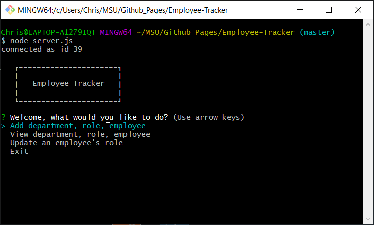
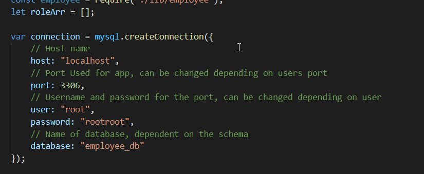

# Employee-Tracker

This project was designed as a homework assignment for MSU's coding bootcamp. 

This application was created with the use of Javascript, Node.js, mysql, and Boxen, console.table, and inquirer packages.

This projects' code can be found on my github (Link can be found below).

# Table of Contents
1. [Links](#Links)
2. [Project Overview](#projectoverview)
3. [Execution](#Execution)
4. [Contains](#Contains)
5. [Demonstration](#Demonstration)
6. [Future](#Future)

## Links

* [GitHub Repository](https://github.com/CMarcano7/Employee-Tracker)

## Project Overview 

* This project was made so that the user could create an employment database that they could update using a CLI all while using mainly mysql and node.js.

## Execution
### Use the Github Link above:
> First create the database in mysql using the schema and seed files that are provided in the directory.
> Next ensure your database information matches that of what is in the server.js file.

> After you can run an npm install to get all the necessary node modules onto your local system directory.
> Lastly you can run the file by going into your preferred CLI and running the server.js file with node. (If you get a connection as id .. you're good to go)

## Contains: 
* Javascript Files
    * server.js
    * department.js
    * role.js
    * employee.js

* SQL text files
  * schema.sql
  * seed.sql

* Inquirer
    * [Inquirer](https://www.npmjs.com/package/inquirer)

* Boxen
    * [Boxen](https://www.npmjs.com/package/boxen)

* Console.table
    * [Console.table](https://www.npmjs.com/package/console.table)

* mysql
    * [mysql](https://www.npmjs.com/package/mysql)

* Find node.js docs [Here](https://nodejs.org/dist/latest-v14.x/docs/api/)

## Demonstration

* Link to demo [Here](https://drive.google.com/file/d/1Sp9c-vkKKtO352cg74GyReyj3SXtMfXG/view) and [Here]( https://drive.google.com/file/d/1oi4mqH7h2uCmHgp9yLEi_CJZcckCMkr5/view)

* MSU BootCamp

## Future

* For the future of this project I would like to create more layers for the employees, including a link between managers and their employees as well as add an overall budget for employees to the view.